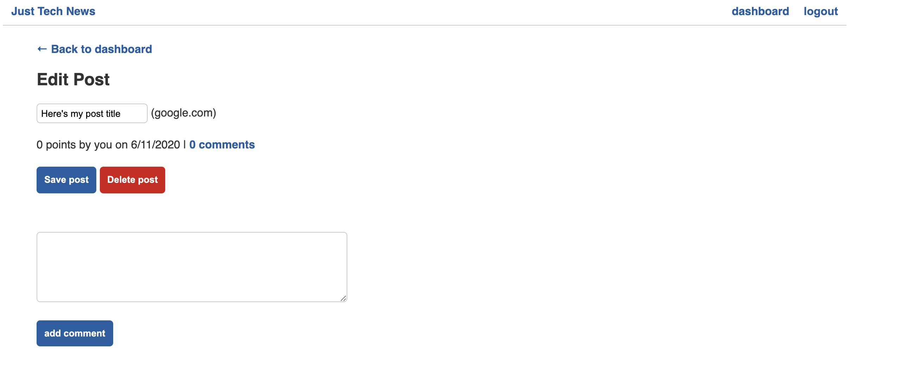

# Just-Tech-News Blog

## Description 
This project is a full stack application and is CMS style blog. This application utilized ORM and MVC. Some of the technologies used in this application include Node, Sequelize, Express, and mySQL. This project connects the View and the Models through controller routes. This application also uses Handlebars templating. 

## Table of Contents
* [Installation](#installation)
* [Usage](#usage)
* [License](#license)
* [Contributing](#contributing)
* [Tests](#tests)
* [Questions](#questions)

## Installation 
The user should clone the repository from GitHub. This application requires Node.js, Express.js, and Sequelize. To connect to the database run `mysql -u root -p` and enter password from .env file. Then source the schema.sql. To seed the file run `npm run seed`. Finally to connect to the server run `npm start`. 

## Usage 
This application will allow users to view, add, comment, vote, and delete blog posts. 
Please view deployed live Heroku [URL](https://stark-refuge-84103.herokuapp.com/)

## License 
This project is license under MIT

## Contributing 
Contributors should read the installation section. 

## Tests
There are test for some formatting in the application. If wanting to view test run `npm test`.

## Questions
If you have any questions about this projects, please contact me directly at nicole.elisaw@gmail.com. You can view more of my projects at https://github.com/nicolewallace09.